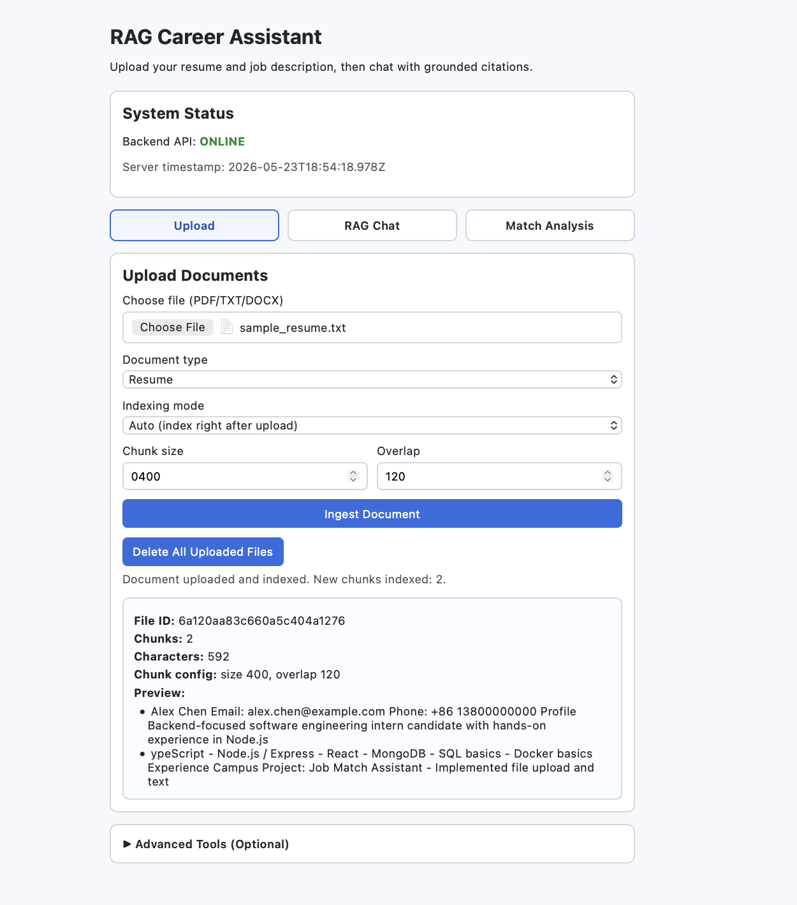
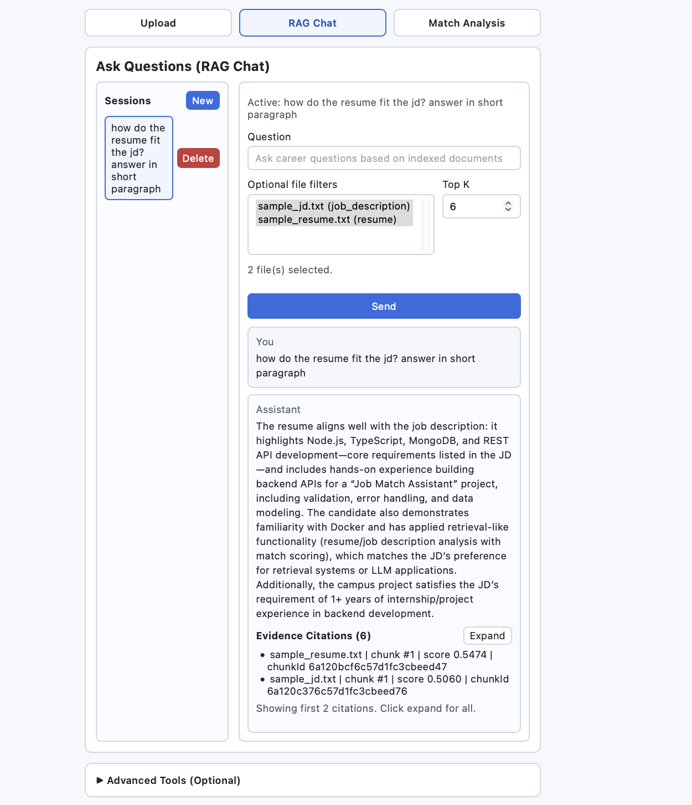
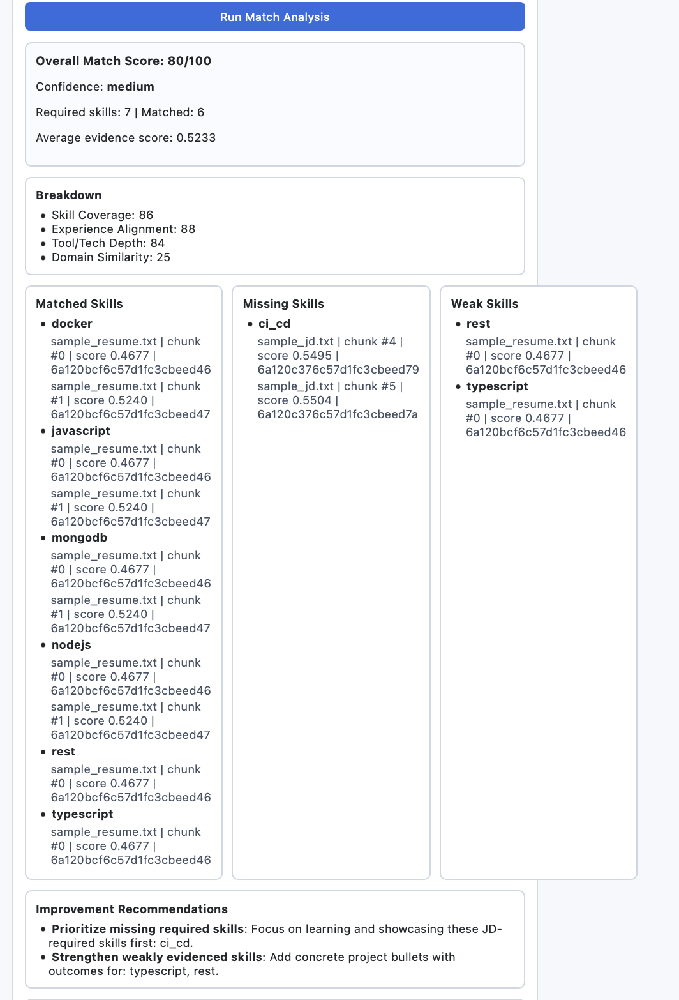
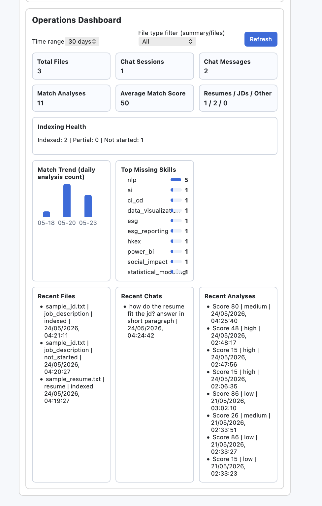

# RAG Career Assistant

- Upload and ingest resume/JD files
- Index chunks to vector DB
- Chat with grounded citations
- Run deterministic match analysis and skill-gap scoring
- View ops dashboard metrics

## Tech Stack

- Frontend: React + Vite + TypeScript
- Backend: Node.js + Express + TypeScript
- App data: MongoDB
- Embeddings/LLM: Qwen (DashScope)
- Vector DB: Qdrant (primary), Mongo vector fallback

## Product Flow

Main tabs:

- Upload
- RAG Chat
- Match Analysis

Advanced tools (optional):

- Vector indexing controls
- Retrieval debugger
- Dashboard

Power BI integration endpoints exist in backend, but BI is hidden in the main UI.

## Local Setup

### 1) Prerequisites

- Node.js 20+
- npm
- MongoDB local instance
- Qdrant local instance (recommended)

Run Qdrant with Docker:

```bash
docker run -p 6333:6333 qdrant/qdrant:latest
```

Qdrant dashboard: `http://localhost:6333/dashboard`

### 2) Environment

Create `backend/.env`:

```env
PORT=4000
CLIENT_ORIGIN=http://localhost:5173
MONGODB_URI=mongodb://127.0.0.1:27017/rag-career-assistant
USE_IN_MEMORY_MONGO=false

MAX_FILE_SIZE_MB=5
DEFAULT_CHUNK_SIZE=800
DEFAULT_CHUNK_OVERLAP=120

EMBEDDING_PROVIDER=qwen
DASHSCOPE_API_KEY=your_dashscope_api_key
QWEN_EMBEDDING_MODEL=text-embedding-v3
LOCAL_EMBEDDING_DIM=384

VECTOR_DB_MODE=qdrant
QDRANT_URL=http://127.0.0.1:6333
QDRANT_API_KEY=
QDRANT_COLLECTION=career_chunks
EMBEDDING_BATCH_SIZE=16

QWEN_CHAT_MODEL=qwen-plus
CHAT_MAX_CONTEXT_CHUNKS=6
CHAT_MIN_RELEVANCE_SCORE=0.25
CHAT_FALLBACK_TO_EXTRACTIVE=false

M5_ANALYSIS_DEFAULT_TOPK=8

# Optional backend BI endpoints (UI currently hides BI panel)
POWERBI_MODE=public
POWERBI_EMBED_URL=
POWERBI_REPORT_ID=
POWERBI_TENANT_ID=
POWERBI_CLIENT_ID=
POWERBI_CLIENT_SECRET=
POWERBI_WORKSPACE_ID=
```

### 3) Install and run

```bash
npm install
npm install --prefix backend
npm install --prefix frontend
```

Run backend:

```bash
npm run dev --prefix backend
```

Run frontend:

```bash
npm run dev --prefix frontend
```

Frontend: `http://localhost:5173`

## Current Features

### Upload + Ingestion

- PDF/TXT/DOCX upload
- Text extraction + chunking
- Metadata/chunks persisted in MongoDB
- Indexing mode toggle:
  - Manual
  - Auto index after upload
- Destructive action:
  - Delete all uploaded files/chunks/vector mappings

### Vector Indexing + Retrieval

- Index one file or all pending files
- Multi-provider embeddings (Qwen/local)
- Qdrant or Mongo vector retrieval
- Similarity scores + source metadata
- Destructive action:
  - Delete all vectors and reset indexing status

### RAG Chat + Citations

- Session-based chat
- Grounded citations (filename/chunk index/chunk id/score)
- Insufficient-evidence guardrail response
- Multi-file filter support (select multiple indexed files)

### Match Analysis

Deterministic scoring (0-100), weighted rubric:

- Skill Coverage (50%)
- Experience Alignment (20%)
- Tool/Tech Depth (20%)
- Domain Similarity (10%)

Outputs:

- Overall score + confidence
- Matched / missing / weak skills
- Evidence-backed references
- Recommendations

### Dashboard

- KPI summary
- Match trend
- Top missing skills
- Recent activity

## Demo (Text + Screenshots)

This section is designed for quick review by recruiters/interviewers without running the project first.

### Screenshot Folder Convention

Put screenshots in `docs/images/` and keep these filenames:

- `docs/images/demo-upload.png`
- `docs/images/demo-chat.png`
- `docs/images/demo-match.png`
- `docs/images/demo-dashboard.png`

### 1) Upload Documents

User uploads resume/JD files (`PDF/TXT/DOCX`), chooses document type, and selects indexing mode:

- `Auto`: indexes immediately after upload
- `Manual`: upload first, then click manual index

The app validates file type/size and stores chunks in MongoDB for downstream retrieval and analysis.



### 2) Ask Questions (RAG Chat + Citations)

User creates a chat session, asks career-fit questions, and optionally filters retrieval by selecting one or multiple indexed files.

The assistant returns grounded answers with traceable citations:

- source file name
- chunk index
- chunk id
- similarity score

If evidence is weak, the app responds with an explicit insufficient-evidence message.



### 3) Get Match Score and Skill Gaps

User selects one resume file and one JD file, then runs deterministic analysis.

The app outputs:

- overall match score (0-100)
- category breakdown (skill, experience, depth, domain)
- matched/missing/weak skills
- evidence-backed recommendations

This score is formula-based and reproducible (not arbitrary LLM scoring).



### 4) Dashboard (Advanced Tools)

In Advanced Tools, dashboard shows operational and analysis metrics:

- total files/chats/analyses
- indexing health
- match trend by day
- top missing skills
- recent activity

This helps reviewers see product behavior across the full workflow.



### End-to-End Demo Summary

Core flow:

1. Upload resume + JD
2. Index vectors (auto or manual)
3. Ask chat question with citations
4. Run match analysis
5. Confirm dashboard updates

Expected reviewer takeaway: this is a complete RAG application, not just a single endpoint demo.

## API Quick Reference

### Health

- `GET /api/health`

### Ingestion

- `POST /api/ingest`
- `GET /api/ingest/files`
- `DELETE /api/ingest/files`

### Vectors

- `POST /api/vector/index/file/:fileId`
- `POST /api/vector/index/all`
- `DELETE /api/vector/index/all`
- `GET /api/vector/index/status`
- `POST /api/vector/retrieve`

Retrieval request supports both:

- `fileId` (single)
- `fileIds` (multi)

### Chat

- `POST /api/chat/sessions`
- `GET /api/chat/sessions`
- `GET /api/chat/sessions/:sessionId/messages`
- `POST /api/chat/sessions/:sessionId/messages`

Send message payload:

```json
{
  "question": "How does this candidate match backend intern role?",
  "topK": 6,
  "fileIds": ["resume_file_id", "jd_file_id"]
}
```

### Match Analysis

- `POST /api/analysis/match`
- `GET /api/analysis`

### Dashboard

- `GET /api/dashboard/summary?days=30&fileType=resume`
- `GET /api/dashboard/match-trend?days=30`
- `GET /api/dashboard/skill-gaps?limit=10`

### BI Export (optional backend endpoints)

- `GET /api/bi/dataset`
- `GET /api/bi/export/json`
- `GET /api/bi/export/csv`
- `GET /api/bi/powerbi/embed-config`

## Build and Tests

Build all:

```bash
npm run build
```

Backend tests:

```bash
npm run test --prefix backend
```

Note: in some sandboxed environments, `tsx --test` may fail due IPC permission (`EPERM`), while build still passes.

## Ship Checklist

- [ ] Backend and frontend both run locally
- [ ] Upload + auto/manual indexing both work
- [ ] Chat returns grounded citations
- [ ] Multi-file chat filter works
- [ ] Match analysis returns deterministic score + skills
- [ ] Dashboard reflects recent activity
- [ ] README and `.env` are up to date
- [ ] No lint/type errors on changed files

## Known Limitations

- No auth/authorization yet (demo-focused app)
- Delete-all endpoints are intentionally powerful for local demos
- Skill extraction is deterministic keyword-based, not ontology-complete
- Charts are lightweight (no advanced interactive analytics)

